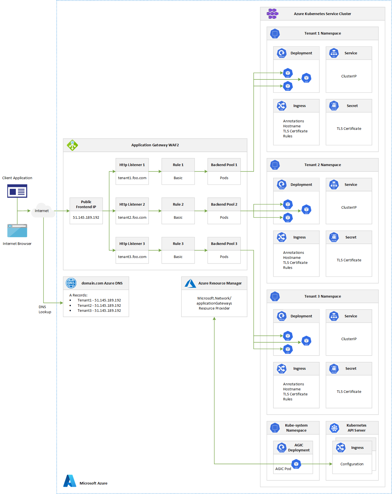

# Use Application Gateway Ingress Controller in a multi-tenant AKS cluster #

This sample shows how to use the Application Gateway Ingress Controller in a multi-tenant AKS cluster to expose multiple instances of the same application, one for each tenant, using a different subdomain.

## Multi-tenancy ##

A multi-tenant Kubernetes cluster is shared by multiple users and/or workloads which are commonly referred to as "tenants". This includes clusters shared by different teams or division within a single organization, as well as Kubernetes clusters that are shared by per-customer instances of a software as a service (SaaS) application. Cluster multi-tenancy is an alternative to managing many single-tenant dedicated clusters. The operators of multi-tenant Kubernetes clusters must isolate tenants from each other to minimize the damage that a compromised or malicious tenant can do to the cluster and other tenants. When several users or teams share the same cluster with a fixed number of nodes, there is a concern that one team could use more than its fair share of resources. [Resource Quotas](https://kubernetes.io/docs/concepts/policy/resource-quotas/) are a tool for administrators to address this concern.

When you plan bulding a multi-tenant AKS cluster you should consider the layers of resource isolation provided by Kubernetes: cluster, namespace, node, pod, and container. You should also consider the security implications of sharing different types of resources among tenants. For example, scheduling pods from different tenants on the same node could reduce the number of machines needed in the cluster. On the other hand, you might need to prevent certain workloads from being colocated. For example, you might not allow untrusted code from outside of your organization to run on the same node as containers that process sensitive information.

Although Kubernetes cannot guarantee perfectly secure isolation between tenants, it does offer features that may be sufficient for specific use cases. As a best practice, you should separate each tenant and their Kubernetes resources into their own namespaces. You can then use [Kubernetes RBAC](https://kubernetes.io/docs/reference/access-authn-authz/rbac/) and [Network Policies](https://kubernetes.io/docs/concepts/services-networking/network-policies/) to enforce tenant isolation. For example, the following picture shows the typical SaaS Provider Model that hosts multiple instances of the same application on the same cluster, one for each tenant. Each application lives in a separate namespace.


Typically, every tenant initiates the deployment of a dedicated instance of the application through a SaaS provider management portal or API.
At this point, the SaaS provider runtime creates a dedicated namespace for the tenant and creates all the necessary entities (deployments, services, secrets, ingress, etc.). This process is fully transparent to the tenant that does not directly deploy the application to the shared cluster. If the application makes use of an ingress controller to expose its services, a subdomain may be created for the new tenant along with a certificate for TLS termination and an A record in the DNS server to associate the new subdomain to the public IP address used by the ingress controller. When tenants need a higher level of physical isolation and guaranteed performance, their workloads can be deployed to a dedicated set of nodes, dedicated pool, or even a dedicated cluster.

## Prerequisites ##

The following components are required to run this sample:

- [.NET Core 3.1](https://dotnet.microsoft.com/download/dotnet-core/3.1)
- [Visual Studio Code](https://code.visualstudio.com/)
- [Azure CLI](https://docs.microsoft.com/cli/azure/install-azure-cli?view=azure-cli-latest)
- [Azure subscription](https://azure.microsoft.com/free/)
- [Azure DNS Zone](https://docs.microsoft.com/en-us/azure/dns/dns-overview) configured with an existing DNS domain
- (Optional)[Helm](https://helm.sh)

## Architecture ##

This diagram shows the architecture used to test the sample. For more information on how to deploy this architecture, see [Create an Azure Kubernetes Service cluster with the Application Gateway Ingress Controller](https://github.com/paolosalvatori/aks-agic).


In this architecture, the [Application Gateway Ingress Controller](https://azure.github.io/application-gateway-kubernetes-ingress/) was installed using the [AGIC add-on for AKS](https://docs.microsoft.com/en-us/azure/application-gateway/tutorial-ingress-controller-add-on-new). You can also [install the Application Gateway Ingress Controller via a Helm chart](https://docs.microsoft.com/en-us/azure/application-gateway/ingress-controller-install-existing#multi-cluster--shared-application-gateway). The primary benefit of deploying AGIC as an AKS add-on is that it's much simpler than deploying through Helm. For a new setup, you can deploy a new Application Gateway and a new AKS cluster with AGIC enabled as an add-on in one line in Azure CLI. The add-on is also a fully managed service, which provides added benefits such as automatic updates and increased support. Both ways of deploying AGIC (Helm and AKS add-on) are fully supported by Microsoft. Additionally, the add-on allows for better integration with AKS as a first class add-on.

The AGIC add-on is still deployed as a pod in the customer's AKS cluster, however, there are a few differences between the Helm deployment version and the add-on version of AGIC. Below is a list of differences between the two versions:

- Helm deployment values cannot be modified on the AKS add-on:

  - `verbosityLevel` will be set to 5 by default
  - `usePrivateIp` will be set to be false by default; this can be overwritten by the use-private-ip annotation
  - `shared` is not supported on add-on
  - `reconcilePeriodSeconds` is not supported on add-on
  - `armAuth.type` is not supported on add-on

- AGIC deployed via Helm supports `ProhibitedTargets`, which means AGIC can configure the Application Gateway specifically for AKS clusters without affecting other existing backends. AGIC add-on doesn't currently support this.
- Since AGIC add-on is a managed service, customers will automatically be updated to the latest version of AGIC add-on, unlike AGIC deployed through Helm where the customer must manually update AGIC.
- As shown in the following picture, customers can only deploy one AGIC add-on per AKS cluster, and each AGIC add-on currently can only target one Application Gateway. For deployments that require more than one AGIC per cluster or multiple AGICs targeting one Application Gateway, please continue to use AGIC deployed through Helm.


As documented at [Enable multiple Namespace support in an AKS cluster with Application Gateway Ingress Controller](https://docs.microsoft.com/en-us/azure/application-gateway/ingress-controller-multiple-namespace-support), a single instance of the Azure Application Gateway Kubernetes Ingress Controller (AGIC) can ingest events from and observe multiple namespaces. Should the AKS administrator decide to use App Gateway as an ingress, all namespaces will use the same instance of Application Gateway. A single installation of Ingress Controller will monitor accessible namespaces and will configure the Application Gateway it is associated with.

To enable multiple namespace support:

- modify the helm-config.yaml file in one of the following ways:

  - delete the `watchNamespace` key entirely from helm-config.yaml - AGIC will observe all namespaces
  - set `watchNamespace` to an empty string - AGIC will observe all namespaces
  - add multiple namespaces separated by a comma (`watchNamespace: default,secondNamespace`) - AGIC will observe these namespaces exclusively
- apply Helm template changes with: `helm install -f helm-config.yaml application-gateway-kubernetes-ingress/ingress-azure`

Once deployed with the ability to observe multiple namespaces, AGIC will:

- list ingress resources from all accessible namespaces
- filter to ingress resources annotated with kubernetes.io/ingress.class: azure/application-gateway
- compose combined [Application Gateway config](https://github.com/Azure/azure-sdk-for-go/blob/37f3f4162dfce955ef5225ead57216cf8c1b2c70/services/network/mgmt/2016-06-01/network/models.go#L1710-L1744)
- apply the config to the associated Application Gateway via [ARM](https://docs.microsoft.com/en-us/azure/azure-resource-manager/management/overview)

## Limits ##

[Azure subscription and service limits, quotas, and constraints](https://docs.microsoft.com/en-us/azure/azure-resource-manager/management/azure-subscription-service-limits#networking-limits) documentation reports that the max number of:

- Active Listeners
- Backend Pools
- HTTP Load Balancing Rules
- HTTP Settings
- Authentication certificates
- Etc.

is 100, and in case of WAF-enabled SKUs, this limit is 40. This implies that the maximum number of tenants that can be served by a single AGIC is equal to 100 when using Application Gateway Standard V2, and 40 for Application Gateway WAF V2.

## Application Gateway Ingress Controller ##

The [Application Gateway Ingress Controller](https://azure.github.io/application-gateway-kubernetes-ingress/) (AGIC) allows Azure Application Gateway to be used as the ingress for an [Azure Kubernetes Service](https://azure.microsoft.com/en-us/services/kubernetes-service/) also known as AKS cluster. As shown in the figure below, the ingress controller runs as a pod within the AKS cluster. It consumes [Kubernetes Ingress Resources](http://kubernetes.io/docs/user-guide/ingress/) and converts their settings to an Azure Application Gateway configuration which allows the gateway to load-balance traffic to Kubernetes pods. This sample shows how to deploy a sizeable number of instances of an ASP.NET Core application, one for each tenant, and how the Application Gateway Ingress Controller pod translates the configuration of each ingress resource to a configuration of the Application Gateway to expose each tenant specific app using a dedicated subdomain, as shown in the following picture:



The [Application Gateway Ingress Controller](https://azure.github.io/application-gateway-kubernetes-ingress/) leverages the Application Gateway multiple site hosting feature to expose multiple instances of the same application using a different subdomain for each tenant. Multiple site hosting enables you to configure more than one web application on the same port of an Application Gateway. It allows you to configure a more efficient topology for your deployments by adding up to 100+ websites to a single Application Gateway. Each website can be directed to its own backend pool. In the case of the [Application Gateway Ingress Controller](https://azure.github.io/application-gateway-kubernetes-ingress/), the backend pool is composed of the pods identified using label selectors by the Kubernetes [Service](https://kubernetes.io/docs/tutorials/kubernetes-basics/expose/expose-intro/) that the ingress controller routes requests to based on the [Ingress](http://kubernetes.io/docs/user-guide/ingress/) configuration. As shown in the picture above, let's assume that three distinct instances of the same application are deployed in the same multi-tenant cluster, each in a separate namespace. The [Ingress](http://kubernetes.io/docs/user-guide/ingress/) resource of each instance specifies a different subdomain and routes incoming requests to the service located in the same namespace. In this context, each subdomain, `tenant1.foo.com`, `tenant2.foo.com`, and `tenant3.foo.com`, point to the same public IP address specified in the Frontend IP Configuration of the Application Gateway. An A record must be created in the DNS server to associate each subdomain with the Public IP Address of the Application Gateway. As you can see in the picture above, when the [Ingress](http://kubernetes.io/docs/user-guide/ingress/) resource gets created, the AGIC pod reads the Ingress configuration from the API Server of the Kubernetes cluster and creates the following resources in the Application Gateway:

- An Http Listener that listens for calls to the `tenant-n.foo.com` hostname
- A Basic rule that sends requests to the downstream backend pool
- A Backend Pool composed of the pods referenced by the Kubernetes service(s)
- An HTTP Settings resource
- An Health Probe

## Run the Sample ##

In order to deploy and test the sample, please follow these steps:

- Use [Visual Studio Code](https://code.visualstudio.com/) or [Visual Studio](https://visualstudio.microsoft.com/) to build the ASP.NET Core application and create a Docker container image on your local machine
- Run the `01-install-cert-manager.sh` bash script to install [cert-manager](https://github.com/jetstack/cert-manager) [Helm](https://helm.sh/) chart on your existing AKS cluster. The script will:

  - Install `jq` and `yq` if not already installed
  - Create a new `cert-manager` namespace on your AKS
  - Create the following CRDs: `Certificate`, `Challenge`, `ClusterIssuer`, `Issuer`, `Order`
  - Install `cert-manager` chart. For more information, see [How to install cert-manager on Kubernetes](https://docs.cert-manager.io/en/latest/getting-started/install/kubernetes.html#steps)

```sh
#/bin/bash

# Variables
namespace="cert-manager"
repoName="jetstack"
repoUrl="https://charts.jetstack.io"
chartName="cert-manager"
releaseName="cert-manager"
version="v1.2.0"

# check if namespace exists in the cluster
result=$(kubectl get ns -o jsonpath="{.items[?(@.metadata.name=='$namespace')].metadata.name}")

if [[ -n $result ]]; then
    echo "$namespace namespace already exists in the cluster"
else
    echo "$namespace namespace does not exist in the cluster"
    echo "creating $namespace namespace in the cluster..."
    kubectl create namespace $namespace
fi

# Label the ingress-basic namespace to disable resource validation
kubectl label namespace $namespace cert-manager.io/disable-validation=true

# Check if the ingress-nginx repository is not already added
result=$(helm repo list | grep $repoName | awk '{print $1}')

if [[ -n $result ]]; then
    echo "[$repoName] Helm repo already exists"
else
    # Add the Jetstack Helm repository
    echo "Adding [$repoName] Helm repo..."
    helm repo add $repoName $repoUrl
fi

# Update your local Helm chart repository cache
echo 'Updating Helm repos...'
helm repo update

# Install cert-manager Helm chart
result=$(helm list -n $namespace | grep $releaseName | awk '{print $1}')

if [[ -n $result ]]; then
    echo "[$releaseName] cert-manager already exists in the $namespace namespace"
else
    # Install the cert-manager Helm chart
    echo "Deploying [$releaseName] cert-manager to the $namespace namespace..."
    helm install $releaseName $repoName/$chartName \
        --namespace $namespace \
        --version $version \
        --set installCRDs=true \
        --set nodeSelector."beta\.kubernetes\.io/os"=linux
fi
```

- Run the the `02-create-cluster-issuer.sh` bash script to create a `ClusterIssuer` resource. It is required by `cert-manager` to represent the `Lets Encrypt` certificate authority where the signed certificates will be obtained. By using the non-namespaced `ClusterIssuer` resource, `cert-manager` will issue certificates that can be consumed from multiple namespaces. Let’s Encrypt uses the ACME protocol to verify that you control a given domain name and to issue you a certificate. More details on configuring `ClusterIssuer` properties here. `ClusterIssuer` will instruct `cert-manager` to issue certificates using the Lets Encrypt staging environment used for testing (the root certificate not present in browser/client trust stores). The default challenge type in the YAML below is http01. Other challenges are documented on [letsencrypt.org - Challenge Types](https://letsencrypt.org/docs/challenge-types/).
  **NOTE**: update the value of the `email` variable with your email address before running the script.

```sh
#/bin/bash

# Variables
email="<your-email-address>"
namespace="default"
clusterIssuer="letsencrypt-application-gateway"
template="cluster-issuer.yml"

# Check if the cluster issuer already exists
result=$(kubectl get clusterissuer -n $namespace -o jsonpath="{.items[?(@.metadata.name=='$clusterIssuer')].metadata.name}")

if [[ -n $result ]]; then
    echo "[$clusterIssuer] cluster issuer already exists"
    exit
else
    # Create the cluster issuer 
    echo "[$clusterIssuer] cluster issuer does not exist"
    echo "Creating [$clusterIssuer] cluster issuer..."
    cat $template | yq -Y "(.spec.acme.email)|="\""$email"\" | kubectl apply -n $namespace -f -
fi
```

The script uses the `cluster-issuer.yml` YAML manifest:

```yaml
apiVersion: cert-manager.io/v1alpha2
kind: ClusterIssuer
metadata:
  name: letsencrypt-application-gateway
spec:
  acme:

    # ACME server URL for Let’s Encrypt’s staging environment.
    # The staging environment will not issue trusted certificates but is
    # used to ensure that the verification process is working properly
    # before moving to production
    server: https://acme-v02.api.letsencrypt.org/directory

    # You must replace this email address with your own.
    # Let's Encrypt will use this to contact you about expiring
    # certificates, and issues related to your account.
    email: MY_EMAIL_ADDRESS

    privateKeySecretRef:
      # Secret resource used to store the account's private key.
      name: letsencrypt
    
    # Enable the HTTP-01 challenge provider
    # you prove ownership of a domain by ensuring that a particular
    # file is present at the domain
    solvers:
    - http01:
        ingress:
          class: azure/application-gateway
```

- Run  the `03-push-docker-images.sh` bash script to push the container image from your local machine to Azure Container Registry (ACR).
  **NOTE**: update the value of the `acrName` variable with the name of your ACR before running the script.

```sh
#!/bin/bash

# Variables
acrName="<acr-name>"
imageName="syntheticapi"
tag="latest"

# Login to ACR
az acr login --name ${acrName,,} 

# Retrieve ACR login server. Each container image needs to be tagged with the loginServer name of the registry. 
echo "Logging to [$acrName] Azure Container Registry..."
loginServer=$(az acr show --name $acrName --query loginServer --output tsv)

# Tag the local image with the loginServer of ACR
docker tag $imageName:$tag $loginServer/$imageName:$tag

# Push local container image to ACR
docker push $loginServer/$imageName:$tag

# Show the repository
echo "This is the [$imageName:$tag] container image in the [$acrName] Azure Container Registry:"
az acr repository show --name $acrName \
                       --image $imageName:$tag 
```
- The sample provides a [Helm](https://helm.sh/) chart in the `syntheticapi` folder. Run the `04-deploy-apps-via-helm.sh` script to deploy an instance of the application for each tenant specified in the `tenants` array. If you use For each tenant, the Helm chart will:

  - Create a namespace
  - Create a service account in the tenant namespace
  - Create a deployment for the application instance in the tenant namespace
  - Create a service for the application instance in the tenant namespace
  - Create an ingress in the tenant namespace with <tenant-name>.<domain-name> as hostname
  - Read the public IP address from the ingress
  - Check if an A record exists in the DNS zone on Azure. If yes, the script will delete it.
  - Create an A record with the name of the tenant and the Application Gateway public IP as address

  **NOTE**: Ensure that your Application Gateway has a public Frontend IP configuration with a public DNS name. Also, make sure to update all the placeholders before running the bash script. Feel free to change the name of the deployment, ingress, service, or the number and name of sample tenants.

```sh
#!/bin/bash

# Variables
tenants=("mars" "jupiter" "saturn")
acrName="SallyAcr"
chart="../syntheticapi"
imageName="${acrName,,}.azurecr.io/syntheticapi"
imageTag="latest"
dnsZoneName="babosbird.com"
dnsZoneResourceGroupName="DnsResourceGroup"
retries=150
sleepInterval=2

for tenant in ${tenants[@]}; do

    # Check if the Helm release already exists
    echo "Checking if a [$tenant] Helm release exists in the [$tenant] namespace..."
    release=$(helm list -n $tenant | awk '{print $1}' | grep -Fx $tenant)
    hostname="$tenant.$dnsZoneName"

    if [[ -n $release ]]; then
        # Install the Helm chart for the tenant to a dedicated namespace
        echo "A [$tenant] Helm release already exists in the [$tenant] namespace"
        echo "Upgrading the [$tenant] Helm release to the [$tenant] namespace via Helm..."
        helm upgrade $tenant $chart \
        --set image.repository=$imageName \
        --set image.tag=$imageTag \
        --set nameOverride=$tenant \
        --set ingress.hosts[0].host=$hostname \
        --set ingress.tls[0].hosts[0]=$hostname

        if [[ $? == 0 ]]; then
            echo "[$tenant] Helm release successfully upgraded to the [$tenant] namespace via Helm"
        else
            echo "Failed to upgrade [$tenant] Helm release to the [$tenant] namespace via Helm"
            exit
        fi
    else
        # Install the Helm chart for the tenant to a dedicated namespace
        echo "The [$tenant] Helm release does not exist in the [$tenant] namespace"
        echo "Deploying the [$tenant] Helm release to the [$tenant] namespace via Helm..."
        helm install $tenant $chart \
        --create-namespace \
        --namespace $tenant \
        --set image.repository=$imageName \
        --set image.tag=$imageTag \
        --set nameOverride=$tenant \
        --set ingress.hosts[0].host=$hostname \
        --set ingress.tls[0].hosts[0]=$hostname

        if [[ $? == 0 ]]; then
            echo "[$tenant] Helm release successfully deployed to the [$tenant] namespace via Helm"
        else
            echo "Failed to install [$tenant] Helm release to the [$tenant] namespace via Helm"
            exit
        fi
    fi

    # Retrieve the public IP address from the ingress
    ingressName=$tenant
    echo "Retrieving the external IP address from the [$ingressName] ingress..."
    for ((i = 0; i < $retries; i++)); do
        sleep $sleepInterval
        publicIpAddress=$(kubectl get ingress $ingressName -n $tenant -o jsonpath='{.status.loadBalancer.ingress[0].ip}')

        if [[ -n $publicIpAddress ]]; then
            if [[ $i > 0 ]]; then
                echo ''
            fi
            echo "[$publicIpAddress] external IP address successfully retrieved from the [$ingressName] ingress in the [$tenant] namespace"
            break
        else
            echo -n "."
        fi
    done

    if [[ -z $publicIpAddress ]]; then
        echo "Failed to retrieve the external IP address from the [$ingressName] ingress in the [$tenant] namespace"
        exit
    fi

    # Check if an A record for todolist subdomain exists in the DNS Zone
    echo "Retrieving the A record for the [$tenant] subdomain from the [$dnsZoneName] DNS zone..."
    ipv4Address=$(az network dns record-set a list \
        --zone-name $dnsZoneName \
        --resource-group $dnsZoneResourceGroupName \
        --query "[?name=='$tenant'].aRecords[].ipv4Address" \
        --output tsv)

    if [[ -n $ipv4Address ]]; then
        echo "An A record already exists in [$dnsZoneName] DNS zone for the [$tenant] subdomain with [$ipv4Address] IP address"

        if [[ $ipv4Address == $publicIpAddress ]]; then
            echo "The [$ipv4Address] ip address of the existing A record is equal to the ip address of the [$ingressName] ingress"
            echo "No additional step is required"
            continue
        else
            echo "The [$ipv4Address] ip address of the existing A record is different than the ip address of the [$ingressName] ingress"
        fi

        # Retrieving name of the record set relative to the zone
        echo "Retrieving the name of the record set relative to the [$dnsZoneName] zone..."

        recordSetName=$(az network dns record-set a list \
            --zone-name $dnsZoneName \
            --resource-group $dnsZoneResourceGroupName \
            --query "[?name=='$tenant'].name" \
            --output tsv 2>/dev/null)

        if [[ -n $recordSetName ]]; then
            echo "[$recordSetName] record set name successfully retrieved"
        else
            echo "Failed to retrieve the name of the record set relative to the [$dnsZoneName] zone"
            exit
        fi

        # Remove the A record
        echo "Removing the A record from the record set relative to the [$dnsZoneName] zone..."

        az network dns record-set a remove-record \
            --ipv4-address $ipv4Address \
            --record-set-name $recordSetName \
            --zone-name $dnsZoneName \
            --resource-group $dnsZoneResourceGroupName

        if [[ $? == 0 ]]; then
            echo "[$ipv4Address] ip address successfully removed from the [$recordSetName] record set"
        else
            echo "Failed to remove the [$ipv4Address] ip address from the [$recordSetName] record set"
            exit
        fi
    fi

    # Create the A record
    echo "Creating an A record in [$dnsZoneName] DNS zone for the [$tenant] subdomain with [$publicIpAddress] IP address..."
    az network dns record-set a add-record \
        --zone-name $dnsZoneName \
        --resource-group $dnsZoneResourceGroupName \
        --record-set-name $tenant \
        --ipv4-address $publicIpAddress 1>/dev/null

    if [[ $? == 0 ]]; then
        echo "A record for the [$tenant] subdomain with [$publicIpAddress] IP address successfully created in [$dnsZoneName] DNS zone"
    else
        echo "Failed to create an A record for the $tenant subdomain with [$publicIpAddress] IP address in [$dnsZoneName] DNS zone"
    fi

done
```

- As an alternative, you can run the `05-deploy-apps-via-kubectl.sh` script to deploy an instance of the application for each tenant without using [Helm](https://helm.sh/). If you use For each tenant, the script will:

  - Create a namespace
  - Create a deployment for the application instance in the tenant namespace
  - Create a service for the application instance in the tenant namespace
  - Create an ingress in the tenant namespace with <tenant-name>.<domain-name> as hostname
  - Read the public IP address from the ingress
  - Check if an A record exists in the DNS zone on Azure. If yes, the script will delete it.
  - Create an A record with the name of the tenant and the Application Gateway public IP as address

```sh
#!/bin/bash

# Variables
tenants=("mars" "jupiter" "saturn")
acrName="SallyAcr"
imageName="${acrName,,}.azurecr.io/syntheticapi:latest"
deploymentName="syntheticapi"
deploymentTemplate="deployment.yml"
serviceName="syntheticapi"
serviceTemplate="service.yml"
ingressName="syntheticapi"
ingressTemplate="ingress.yml"
dnsZoneName="babosbird.com"
dnsZoneResourceGroupName="DnsResourceGroup"
retries=150
sleepInterval=2

for tenant in ${tenants[@]}; do

    # Create the namespace for the tenant if it doesn't already exists in the cluster
    #result=$(kubectl get namespace | grep $tenant | awk '{print $1}')
    result=$(kubectl get namespace -o jsonpath="{.items[?(@.metadata.name=='$tenant')].metadata.name}")

    if [[ -n $result ]]; then
        echo "[$tenant] namespace already exists in the cluster"
    else
        echo "[$tenant] namespace does not exist in the cluster"
        echo "creating [$tenant] namespace in the cluster..."
        kubectl create namespace $tenant
    fi

    # Create the deployment for the tenant if it doesn't already exists in the cluster
    result=$(kubectl get deployment -n $tenant -o jsonpath="{.items[?(@.metadata.name=='$deploymentName')].metadata.name}")


    if [[ -n $result ]]; then
        echo "[$deploymentName] deployment already exists in the [$tenant] namespace"
    else
        echo "[$deploymentName] deployment does not exist in the [$tenant] namespace"
        echo "creating [$deploymentName] deployment in the [$tenant] namespace..."
        cat $deploymentTemplate |
            yq -Y "(.spec.template.spec.containers[0].image)|="\""$imageName"\" |
            kubectl apply -n $tenant -f -
    fi

    # Create the service for the tenant if it doesn't already exists in the cluster
    result=$(kubectl get service -n $tenant -o jsonpath="{.items[?(@.metadata.name=='$serviceName')].metadata.name}")

    if [[ -n $result ]]; then
        echo "[$serviceName] service already exists in the [$tenant] namespace"
    else
        echo "[$serviceName] service does not exist in the [$tenant] namespace"
        echo "creating [$serviceName] service in the [$tenant] namespace..."
        kubectl apply -n $tenant -f $serviceTemplate
    fi

    # Check if the ingress already exists
    result=$(kubectl get ingress -n $tenant -o jsonpath="{.items[?(@.metadata.name=='$ingressName')].metadata.name}")

    if [[ -n $result ]]; then
        echo "[$ingressName] ingress already exists in the [$tenant] namespace"
    else
        # Create the ingress
        echo "[$ingressName] ingress does not exist in the [$tenant] namespace"
        host="$tenant.$dnsZoneName"
        echo "Creating [$ingressName] ingress in the [$tenant] namespace with [$host] host..."
        cat $ingressTemplate |
            yq -Y "(.metadata.name)|="\""$ingressName"\" |
            yq -Y "(.metadata.namespace)|="\""$tenant"\" |
            yq -Y "(.spec.tls[0].hosts[0])|="\""$host"\" |
            yq -Y "(.spec.rules[0].host)|="\""$host"\" |
            kubectl apply -n $tenant -f -
    fi

    # Retrieve the public IP address from the ingress
    echo "Retrieving the external IP address from the [$ingressName] ingress..."
    for ((i = 0; i < $retries; i++)); do
        sleep $sleepInterval
        publicIpAddress=$(kubectl get ingress $ingressName -n $tenant -o jsonpath='{.status.loadBalancer.ingress[0].ip}')

        if [[ -n $publicIpAddress ]]; then
            if [[ $i > 0 ]]; then
                echo ''
            fi
            echo "[$publicIpAddress] external IP address successfully retrieved from the [$ingressName] ingress in the [$tenant] namespace"
            break
        else
            echo -n "."
        fi
    done

    if [[ -z $publicIpAddress ]]; then
        echo "Failed to retrieve the external IP address from the [$ingressName] ingress in the [$tenant] namespace"
        exit
    fi

    # Check if an A record for todolist subdomain exists in the DNS Zone
    echo "Retrieving the A record for the [$tenant] subdomain from the [$dnsZoneName] DNS zone..."
    ipv4Address=$(az network dns record-set a list \
        --zone-name $dnsZoneName \
        --resource-group $dnsZoneResourceGroupName \
        --query "[?name=='$tenant'].aRecords[].ipv4Address" \
        --output tsv)

    if [[ -n $ipv4Address ]]; then
        echo "An A record already exists in [$dnsZoneName] DNS zone for the [$tenant] subdomain with [$ipv4Address] IP address"

        if [[ $ipv4Address == $publicIpAddress ]]; then
            echo "The [$ipv4Address] ip address of the existing A record is equal to the ip address of the [$ingressName] ingress"
            echo "No additional step is required"
            continue
        else
            echo "The [$ipv4Address] ip address of the existing A record is different than the ip address of the [$ingressName] ingress"
        fi

        # Retrieving name of the record set relative to the zone
        echo "Retrieving the name of the record set relative to the [$dnsZoneName] zone..."

        recordSetName=$(az network dns record-set a list \
            --zone-name $dnsZoneName \
            --resource-group $dnsZoneResourceGroupName \
            --query "[?name=='$tenant'].name" \
            --output tsv 2>/dev/null)

        if [[ -n $recordSetName ]]; then
            echo "[$recordSetName] record set name successfully retrieved"
        else
            echo "Failed to retrieve the name of the record set relative to the [$dnsZoneName] zone"
            exit
        fi

        # Remove the A record
        echo "Removing the A record from the record set relative to the [$dnsZoneName] zone..."

        az network dns record-set a remove-record \
            --ipv4-address $ipv4Address \
            --record-set-name $recordSetName \
            --zone-name $dnsZoneName \
            --resource-group $dnsZoneResourceGroupName

        if [[ $? == 0 ]]; then
            echo "[$ipv4Address] ip address successfully removed from the [$recordSetName] record set"
        else
            echo "Failed to remove the [$ipv4Address] ip address from the [$recordSetName] record set"
            exit
        fi
    fi

    # Create the A record
    echo "Creating an A record in [$dnsZoneName] DNS zone for the [$tenant] subdomain with [$publicIpAddress] IP address..."
    az network dns record-set a add-record \
        --zone-name $dnsZoneName \
        --resource-group $dnsZoneResourceGroupName \
        --record-set-name $tenant \
        --ipv4-address $publicIpAddress 1>/dev/null

    if [[ $? == 0 ]]; then
        echo "A record for the [$tenant] subdomain with [$publicIpAddress] IP address successfully created in [$dnsZoneName] DNS zone"
    else
        echo "Failed to create an A record for the $tenant subdomain with [$publicIpAddress] IP address in [$dnsZoneName] DNS zone"
    fi

done
```

**NOTE**: The ingress resource uses the `cert-manager` to get a TLS certificate from `Lets Encrypt` for the tenant hostname. Note the annotation [cert-manager.io/cluster-issuer: letsencrypt](https://cert-manager.io/docs/usage/ingress/#supported-annotations), which tells the `cert-manager` to process the tagged Ingress resource. Some if the elements in the YAML manifest get replaced by the bash script using the [yq](https://kislyuk.github.io/yq/) before the deployment. 
**NOTE**: the [https://kubernetes.io/docs/concepts/services-networking/ingress/](https://kubernetes.io/docs/concepts/services-networking/ingress/) used to define the Application Gateway Ingress Controller as ingress controller has been deprecated and replaced by the new `ingressClassName`.

## Test the Deployment ##

To validate the deployment, you should see the following entities under the Application Gateway:

- A listener on port 443 for each tenant:


- A basic rule for each tenant:


- An HTTP Settings for each tenant:


- An Health Probe for each tenant:


- A backend pool for each tenant:


- If you click one of the backend pool, you will see that it includes the IP address of the pods referenced by the Kubernetes service


If you open the DNS Zone, you should see an A record for each tenant:


Finally, to test the application, just use your favorite internet broswer to open any tenant-specific web application:


## Application Gateway ##

Azure Application Gateway is a web traffic load balancer that enables customers to manage the inbound traffic to multiple downstream web applications and REST APIs. Traditional load balancers operate at the transport layer (OSI layer 4 - TCP and UDP) and route traffic based on source IP address and port, to a destination IP address and port. The Application Gateway instead is an application layer (OSI layer 7) load balancer. Azure Application Gateway provides a rich set of features:

- [Secure Sockets Layer (SSL/TLS) termination](https://docs.microsoft.com/en-us/azure/application-gateway/features#secure-sockets-layer-ssltls-termination)
- [Autoscaling](https://docs.microsoft.com/en-us/azure/application-gateway/features#autoscaling)
- [Zone redundancy](https://docs.microsoft.com/en-us/azure/application-gateway/features#zone-redundancy)
- [Static VIP](https://docs.microsoft.com/en-us/azure/application-gateway/features#static-vip)
- [Web Application Firewall](https://docs.microsoft.com/en-us/azure/application-gateway/features#web-application-firewall)
- [Ingress Controller for AKS](https://docs.microsoft.com/en-us/azure/application-gateway/features#ingress-controller-for-aks)
- [URL-based routing](https://docs.microsoft.com/en-us/azure/application-gateway/features#url-based-routing)
- [Multiple-site hosting](https://docs.microsoft.com/en-us/azure/application-gateway/features#multiple-site-hosting)
- [Redirection](https://docs.microsoft.com/en-us/azure/application-gateway/features#redirection)
- [Session affinity](https://docs.microsoft.com/en-us/azure/application-gateway/features#session-affinity)
- [WebSocket and HTTP/2 traffic](https://docs.microsoft.com/en-us/azure/application-gateway/features#websocket-and-http2-traffic)
- [Connection draining](https://docs.microsoft.com/en-us/azure/application-gateway/features#connection-draining)
- [Custom error pages](https://docs.microsoft.com/en-us/azure/application-gateway/features#custom-error-pages)
- [Rewrite HTTP headers](https://docs.microsoft.com/en-us/azure/application-gateway/features#rewrite-http-headers-and-url)
- [Sizing](https://docs.microsoft.com/en-us/azure/application-gateway/features#sizing)

For more information, see [How an Application Gateway works](https://docs.microsoft.com/en-us/azure/application-gateway/how-application-gateway-works).

## Web Access Firewall Policy for Application Gateway ##

[Web Application Firewall (WAF)](https://docs.microsoft.com/en-us/azure/web-application-firewall/ag/ag-overview) is a service that provides centralized protection of web applications from common exploits and vulnerabilities. WAF is based on rules from the [OWASP (Open Web Application Security Project) core rule sets](https://owasp.org/www-project-modsecurity-core-rule-set/). WAF also provide the ability to create custom rules that are evaluated for each request that passes through the WAF. These rules hold a higher priority than the rest of the rules in the managed rule sets. The custom rules contain a rule name, rule priority, and an array of matching conditions. If these conditions are met, an action is taken (to allow or block). Web applications can be the target of malicious attacks that exploit common, known vulnerabilities that include SQL injection attacks, DDOS attacks, and cross site scripting attacks. Preventing such attacks in application code can be challenging and may require rigorous maintenance, patching and monitoring at many layers of the application topology. A centralized web application firewall helps make security management much simpler and gives better assurance to application administrators against threats or intrusions. A WAF solution can also react to a security threat faster by patching a known vulnerability at a central location versus securing each of individual web applications. Existing application gateways can be converted to a Web Application Firewall enabled application gateway very easily.
Azure Application Gateway allows the association of a separate WAF policy to each individual listener. For example, if there are three sites behind the same Application Gateway or WAF, you can configure three separate WAF policies (one for each listener) to customize the exclusions, custom rules, and managed rulesets for one site without effecting the other two. If you want a single policy to apply to all sites, you can just associate the policy with the Application Gateway, rather than the individual listeners, to make it apply globally. Application Gateway also supports per-URI WAF Policies. This feature requires the use of a Path-based routing rule instead of a basic routing rule and requires the definition of a URL Path Map where a specific WAF policy can be associated to a given URL. For more information, see [Configure per-site WAF policies using Azure PowerShell](https://docs.microsoft.com/en-us/azure/web-application-firewall/ag/per-site-policies). The order of precedence for WAF policies is as follows:

- If a per-URI WAF policy exists for the current path, this will take effect / apply and no other WAF policy will apply
- If no per-URI WAF policy exists for the current path, but a WAF policy exists for the current listener, this policy will apply, and no other WAF policy will take effect
- If no WAF policy exists for the current URI and listener, the global WAF policy will apply, if any.

The Application Gateway WAF can be configured to run in the following two modes:

- **Detection mode**: Monitors and logs all threat alerts. You turn on logging diagnostics for Application Gateway in the Diagnostics section. You must also make sure that the WAF log is selected and turned on. Web application firewall doesn't block incoming requests when it's operating in Detection mode.
- **Prevention mode**: Blocks intrusions and attacks that the rules detect. The attacker receives a "403 unauthorized access" exception, and the connection is closed. Prevention mode records such attacks in the WAF logs.

You can configure Application Gateway to store diagnostic logs and metrics to Log Analytics. In this case, also WAF logs will be stored in Log Analytics and they can be queries using Kusto Query Language.

## Visio ##

The [Visio](https://github.com/paolosalvatori/aks-multi-tenant-agic/blob/main/visio/aks.vsdx?raw=true) document contains all the above diagrams.

## References ##

Azure Kubernetes Service:

- [Create a private Azure Kubernetes Service cluster](https://github.com/paolosalvatori/private-aks-cluster)
- [Best practices for multi-tenancy and cluster isolation](https://docs.microsoft.com/en-us/azure/aks/operator-best-practices-cluster-isolation)
- [Best practices for basic scheduler features in Azure Kubernetes Service (AKS)](https://docs.microsoft.com/en-us/azure/aks/operator-best-practices-scheduler)
- [Best practices for advanced scheduler features](https://docs.microsoft.com/en-us/azure/aks/operator-best-practices-advanced-scheduler)
- [Best practices for authentication and authorization](https://docs.microsoft.com/en-us/azure/aks/operator-best-practices-advanced-scheduler)
- [Best practices for cluster security and upgrades in Azure Kubernetes Service (AKS)](https://docs.microsoft.com/en-us/azure/aks/operator-best-practices-cluster-security)
- [Best practices for container image management and security in Azure Kubernetes Service (AKS)](https://docs.microsoft.com/en-us/azure/aks/operator-best-practices-container-image-management)
- [Best practices for network connectivity and security in Azure Kubernetes Service (AKS)](https://docs.microsoft.com/en-us/azure/aks/operator-best-practices-network)
- [Best practices for storage and backups in Azure Kubernetes Service (AKS)](https://docs.microsoft.com/en-us/azure/aks/operator-best-practices-storage)
- [Best practices for business continuity and disaster recovery in Azure Kubernetes Service (AKS)](https://docs.microsoft.com/en-us/azure/aks/operator-best-practices-multi-region)
- [Azure Kubernetes Services (AKS) day-2 operations guide](https://docs.microsoft.com/en-us/azure/architecture/operator-guides/aks/day-2-operations-guide)

Azure Application Gateway:

- [Overview of WebSocket support in Application Gateway](https://docs.microsoft.com/en-us/azure/application-gateway/application-gateway-websocket#websocket-enabled-backend)
- [Configure end to end TLS by using Application Gateway with PowerShell](https://docs.microsoft.com/en-us/azure/application-gateway/application-gateway-end-to-end-ssl-powershell)
- [How an Application Gateway works](https://docs.microsoft.com/en-us/azure/application-gateway/how-application-gateway-works)

Azure Application Gateway Ingress Controller

- [What is Application Gateway Ingress Controller?](https://docs.microsoft.com/en-us/azure/application-gateway/ingress-controller-overview)
- [Documentation for Application Gateway Ingress Controller](https://azure.github.io/application-gateway-kubernetes-ingress/)
- [Annotations for Application Gateway Ingress Controller](https://docs.microsoft.com/en-us/azure/application-gateway/ingress-controller-annotations)
- [Certificate issuance with LetsEncrypt.org](https://azure.github.io/application-gateway-kubernetes-ingress/how-tos/lets-encrypt/)
- [Tutorial: Enable the Ingress Controller add-on (preview) for a new AKS cluster with a new Application Gateway instance](https://docs.microsoft.com/en-us/azure/application-gateway/tutorial-ingress-controller-add-on-new)
- [Tutorial: Enable Application Gateway Ingress Controller add-on for an existing AKS cluster with an existing Application Gateway through Azure CLI (Preview)](https://docs.microsoft.com/en-us/azure/application-gateway/tutorial-ingress-controller-add-on-existing)
- [Difference between Helm deployment and AKS Add-On](https://docs.microsoft.com/en-us/azure/application-gateway/ingress-controller-overview#difference-between-helm-deployment-and-aks-add-on)
- [Tutorial: Setting up E2E SSL](https://azure.github.io/application-gateway-kubernetes-ingress/tutorials/tutorial.e2e-ssl/)
- [Tutorial: Basic](https://azure.github.io/application-gateway-kubernetes-ingress/tutorials/tutorial.general/)
- [Certificate issuance with LetsEncrypt.org](https://azure.github.io/application-gateway-kubernetes-ingress/how-tos/lets-encrypt/)

Azure Application Gateway WAF

- [What is Azure Web Application Firewall on Azure Application Gateway?](https://docs.microsoft.com/en-us/azure/web-application-firewall/ag/ag-overview)
- [Web Application Firewall CRS rule groups and rules](https://docs.microsoft.com/en-us/azure/web-application-firewall/ag/application-gateway-crs-rulegroups-rules?tabs=owasp31)
- [Custom rules for Web Application Firewall v2 on Azure Application Gateway](https://docs.microsoft.com/en-us/azure/web-application-firewall/ag/custom-waf-rules-overview)
- [Quickstart: Create an Azure WAF v2 on Application Gateway using an ARM template](https://docs.microsoft.com/en-us/azure/web-application-firewall/ag/quick-create-template)
- [Microsoft.Network/ApplicationGatewayWebApplicationFirewallPolicies Resource Type](https://docs.microsoft.com/en-us/azure/templates/microsoft.network/applicationgatewaywebapplicationfirewallpolicies)
- [Create and use Web Application Firewall v2 custom rules on Application Gateway](https://docs.microsoft.com/en-us/azure/web-application-firewall/ag/create-custom-waf-rules)
- [az network application-gateway waf-policy Azure CLI commands](https://docs.microsoft.com/en-us/cli/azure/network/application-gateway/waf-policy?view=azure-cli-latest)
- [Enable Web Application Firewall using the Azure CLI](https://docs.microsoft.com/en-us/azure/web-application-firewall/ag/tutorial-restrict-web-traffic-cli)
- [Configure per-site WAF policies using Azure PowerShell](https://docs.microsoft.com/en-us/azure/web-application-firewall/ag/per-site-policies)
- [Create Web Application Firewall policies for Application Gateway](https://docs.microsoft.com/en-us/azure/web-application-firewall/ag/create-waf-policy-ag#migrate-to-waf-policy)
